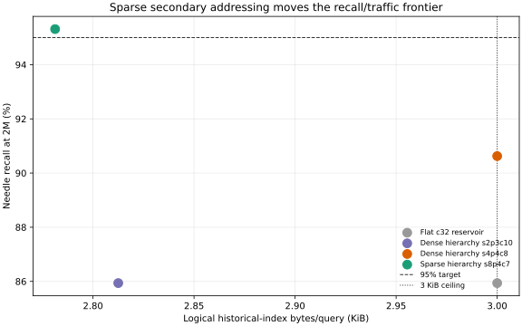
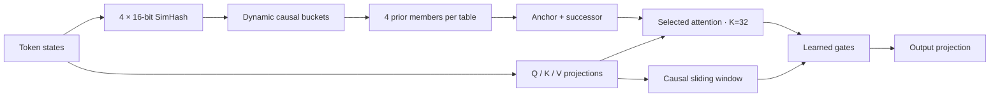

<div align="center">

# Subquadratic Sparse Attention

### Content-routed long-context attention, rebuilt from first principles for Apple silicon.

[](https://github.com/ml-explore/mlx)
[](https://www.python.org/)
[](https://support.apple.com/guide/mac-help/mchl1f6b1e91/mac)
[](LICENSE)

An independent research prototype inspired by the public behavioral claims in the
[SubQ-1.1-Small model card](https://subq.ai/docs/subq-1-1-small-model-card.pdf).
The original SSA mechanism is unpublished; this repository proposes and tests a different architecture.

</div>

---

## What works

The measured baseline combines causal sliding-window attention with content-addressed retrieval through four learned 16-bit SimHash tables. Each query reads a fixed 32-token budget, regardless of context length. The implementation also supports additional tables and lowest-margin multiprobe hashing for the next collision/curriculum experiments.

| Result | Measurement |
|---|---:|
| Exact selector recall at 16K | **100 / 100 needles** |
| Selector latency at 16K | **1.45 ms** |
| Selector peak memory at 16K | **27 MB** |
| Selected-attention latency at 16K | **17.5 ms** |
| Selected-attention peak memory at 16K | **57 MB** |
| Numerical error against NumPy | **< 9 × 10⁻⁷** |
| MQAR held-out accuracy at training length | **99.92%** |
| MQAR accuracy at 16× training length | **95.22%** |
| MQAR mean accuracy at the former 4K frontier | **97.03%** |
| MQAR accuracy at 16K after an 8K fine-tuning stage | **97.38%** |
| LFM2.5 one-layer sparse replacement perplexity penalty | **+1.64% mean** |
| LFM2.5 two-layer model after KL recovery, 65K-token audit | **0.9675× WikiText / 0.8712× PG-19** |
| LFM2.5 expanded 1K retrieval gate, best aggregate | **132 / 189 dense-pass trials** |
| LFM2.5 exact retrieval in expanded gate | **54 / 54 per sparse variant** |

The model was trained at 128 tokens and evaluated without further training:

| Context | Relative length | Accuracy |
|---:|---:|---:|
| 128 | 1× | 100.00% |
| 256 | 2× | 99.01% |
| 512 | 4× | 99.08% |
| 1,024 | 8× | 95.38% |
| 2,048 | 16× | 95.22% |
| 4,096 | 32× | 77.93% |

A controlled three-seed follow-up with eight tables, one probe, two members, and a staged 128/256/512/1,024-token curriculum reaches **97.03% mean accuracy at 4,096 tokens** (33,347 / 34,368 held-out answers). At the same `K=32` budget, curriculum alone reaches 95.61%. After correcting multiprobe indexing so keys are stored only under their exact code and future entries cannot displace past bucket members, the four-table/two-probe checkpoints score 94.23%, not the previously reported 96.81%. Curriculum and additional tables remain supported; multiprobe requires retraining under the corrected selector.

An exploratory seed-0 checkpoint trained through 4K and then fine-tuned for 300 steps at 8K with a fresh optimizer reaches **97.38% at 16K** and **95.32% at 32K**. Carrying one optimizer through the entire from-scratch 8K curriculum performs worse, at 95.67% and 91.41%. MQAR caps the number of stored associations at 512, so these very long cases primarily test retrieval distance and positional extrapolation rather than increasing task complexity.

> [!IMPORTANT]
> These are synthetic multi-query associative-recall results from a tiny experimental model. They are not general language-model, RULER, GPQA, or production-serving results.

### Natural-language donor-router milestone

A separate MLX experiment now freezes SmolLM2-135M and distills its layer-15 distant
attention distribution into eight learned binary hash tables. Across three seeds and
876 held-out queries per seed, hard lookup raises retained teacher-attention mass from
27.32% to 33.36% and teacher top-1 recall from 37.14% to 55.78%, while the mean number
of unique candidates falls from 16.95 to 11.70. The current LFM2.5 experiment goes one
step further and replaces attention layers 12 and 14. Mixed-corpus top-64 teacher-
distribution distillation recovers the two-layer model across three seeds; its
geometric-mean sparse/dense perplexity ratios are 0.9675 on WikiText and 0.8712 on
PG-19 over 65,536 tokens per corpus. See the
[replication ledger and roadmap](docs/replication-roadmap.md) for the full protocol and
the remaining gap to end-to-end replication.

A new paired behavior gate exposes what perplexity misses. Before retrieval-specific
router training, the sparse two-layer model preserves only 3 of 26 natural-language
retrieval cases that dense LFM2.5 answers. Streaming supervision of the router's source
positions with recent-tail selection raises three-seed preservation to 57/78. Keeping
a fixed-budget midpoint-history slot active during router retraining raises this to
**68/78 at `K=32`**, including 17/27 long multi-token values. Exact passkeys remain
27/27 and dense-pass lexical-mismatch cases remain 24/24 across all tested 256–1,024-
token lengths and positions. The gain is seed-dependent: long-value results are 8/9,
0/9, and 9/9. The corresponding large-audit geometric means are 1.0072× dense
perplexity on WikiText and 0.8973× on PG-19.

That small-suite gain does not survive the expanded generalization gate. A fixed
manifest adds three unseen values and two prompt templates for each of exact,
lexical-mismatch, multi-token, and NIAH-style retrieval, with three source positions.
At 1K, dense LFM2.5 passes 63/72 cases. Across three sparse seeds, recent `K=32`
preserves **132/189** dense-pass trials (69.84%), hybrid `K=32` preserves 127/189
(67.20%), and completed-block `K=64` preserves 111/189 (58.73%). All three preserve
54/54 exact trials. Hybrid is strongest on NIAH-style retrieval, block routing is
strongest on multi-token values, and recent routing is strongest overall. A single
4K dense probe peaks at 2.82 GB and a hybrid probe at 2.48 GB, above the repository's
1.792 GB operating limit, so 4K, 8K, and 16K are not claimed for this partially
converted model.

### Routing-only index milestone

A separate synthetic routing benchmark now isolates the selector bottleneck from KV
gather and attention. On an M4 Pro, one-query FP16 and packed 64-bit full scans grow
14.58x and 11.35x respectively from 16K to 2M keys. A persistent four-table direct-
address prototype with two probes, a bounded 128-entry pool, Hamming reranking, and
final `K=32` stays flat at 0.94x. At 2M it routes in 342.9 us versus 3,157.9 us for
FP16 and 3,334.2 us for the binary scan, while its logical historical-index read is
1.5 KiB/query instead of 256 MiB or 16 MiB. The fixed bucket capacity is not enough:
needle recall falls to 53.12%, and overlap with the FP top 32 is only 2.10% at 2M.
This demonstrates bounded lookup over the tested range
in a synthetic prototype; it does not establish general attention quality, production decode
performance, or an end-to-end model speedup.


A matched retention ablation confirms that bucket storage, rather than address
agreement, is the immediate scaling limit. Flat capacity-64 reaches 92.19% needle
recall but reads 6 KiB/query. A sparse hierarchical follow-up splits each primary
bucket with an 8-bit secondary address and stores compact capacity-7 leaves. At 2M it
reaches **95.31% needle recall at 294.4 us/query and 2.78 KiB/query**, satisfying the
predeclared 95% / 3 KiB / 350 us gate. Retention conditional on a valid hierarchical
address is 100% for the 64 planted queries; FP-top32 overlap remains only 3.12%, so
this is not yet a general attention-quality result.




The active donor pair is now current-generation Liquid AI: the causal
[LFM2.5-350M](https://huggingface.co/LiquidAI/LFM2.5-350M) supplies language-model
states and attention targets, while
[LFM2.5-Embedding-350M](https://huggingface.co/LiquidAI/LFM2.5-Embedding-350M)
supplies bidirectional semantic block embeddings. Both run locally on Apple Silicon.
An LFM causal layer-14 smoke test peaks at 672 MB of MLX memory; the separate embedding
probe exposes table-count and Hamming-multiprobe recall/candidate tradeoffs. These are
router plumbing results, not evidence that donor language quality has been preserved.
An inference-aligned router follow-up defines teacher importance as attention weight
times value norm and trains hard Hamming matches with each table responsible for four
of the top 32 targets. Across three seeds, retained teacher contribution rises from
23.41% to 30.97% and hard top-1 recall from 28.27% to 37.40%, while collision
inflation falls from 17.22× to 13.39× the balanced 8-bit baseline.

The first causal integration of those learned addresses into the sparse hierarchy is
a negative model-quality result. On the same held-out 256-token WikiText segment,
three seeds recover only **3.31–4.69% of distant attention mass** and raise perplexity
to **1.325–1.367×** the dense layer-14 baseline. A separate PG-19 validation segment
recovers 4.36–8.11%. Total attention-mass recall remains 86–89% because the fixed
local window dominates it, so distant attention-mass recall is the primary gate.
An oracle shows that the 224-candidate traffic budget is not the immediate ceiling:
at 1,024 tokens its best candidates contain 92.69% of distant mass, but the final
`K=32` ceiling is 55.49% and learned-code Hamming reranking retains only 28.31%.
The attention-mass-aligned follow-up clears its declared **256-token** quality gate.
With adaptive capacity-32 storage, a fixed 336-posting read budget, and four-byte
fingerprints, all three seeds recover at least 80% of the dense `K=32` distant-mass
oracle on both corpora (80.16–85.33%). Logical traffic is 2,808 bytes/query. Sparse
output recovery keeps held-out perplexity within 3.18% of dense for every seed and
corpus. The Python/MLX reference takes 421–446 us/query, so it does not meet the
350-us target.

The same routers do **not** preserve that routing gate at longer lengths. Oracle-
relative distant-mass recall falls to 73.15–76.72% at 512 and 61.37–64.82% at 1,024,
even though address-candidate mass remains high. Output recovery restores 512-token
perplexity to within 3.18% across all seeds, but a conservatively reduced 1,024-token
recovery run reached 1,905 MB and was stopped above the 1,792 MB operating limit.
This is a bounded 256-token routing result plus a documented scaling failure, not a
general long-context attention replacement. Metal fusion remains deferred.

A seed-0 512-token follow-up retrains addresses directly on distant attention mass.
It makes 97-99% of teacher mass addressable, but hot-leaf collapse causes 46-54%
posting eviction under the fixed budget. Direct joint-code entropy regularization
does not resolve the tradeoff: the best tested row reaches only 77.47%/77.95% of the
WikiText/PG-19 `K=32` oracle, below the original 78.81%/79.62% scorer. The next gate
is a capacity-aware objective or learned bounded retention, not more scalar balance
tuning.

A direct deployed-leaf overflow loss then cuts eviction to roughly 15% and lifts
WikiText to 80.15% of its oracle, but PG-19 reaches only 77.88%. This corpus split
rejects further scalar address-spreading sweeps: the next milestone is learned,
attention-aware retention inside crowded leaves. No 512-token router is promoted as
a cross-domain pass.

A linear attention-salience retention score and a stricter loss trained only at each
leaf's capacity boundary also remain below gate (best 79.42%/79.20% across the two
corpora). The next check is an explicitly noncausal oracle retention ceiling before
investing in a richer retention model.

That future-attention oracle reaches 79.25%/80.47%, failing the both-corpus gate, and
original/capacity-aware address interpolation also remains below 80% on at least one
corpus. Retention and checkpoint blending are therefore closed; the next work returns
to domain-balanced discrete address/reranker training selected away from the canonical
held-out gate.

That domain-balanced branch is also now bounded on seed 0. Group-DRO address training
reaches 80.66%/77.99% oracle-relative recall on canonical WikiText/PG-19, and refreshing
the compressed scorer reaches 80.21%/78.16%. A whole-table mixture selected only on
reserved training-domain segments appears strong there but transfers at just
78.78%/78.42%. Finally, training on noncanonical evaluation-domain segments reverses
the corpus imbalance rather than solving it: 79.07%/80.91%, 2,832 bytes/query, and
802-814 us/query. None passes both corpora, so output recovery, seed replication,
latency work, and 1,024-token expansion remain closed. The next router must optimize
the deployed discrete candidate set and scorer jointly across domains; another corpus
weight, projection blend, or table-selection sweep is not justified by these results.

A first candidate-set-level surrogate is implemented and rejected. It prices each
teacher top-32 key by its primary-plus-six-secondary-probe path probability and the
expected capacity-32 reservoir survival of its leaf. Reserved surrogate loss falls
from 0.274 to 0.166, and canonical eviction improves to 14.77%/11.25%, but address
mass collapses to 83.59%/83.76% and deployed recall to 74.87%/75.29%. Expected
survival is therefore not an adequate substitute for the exact causal shortlist.
Do not tune this loss weight on canonical segment 0; the next objective must expose
the hard deployed membership/ranking boundary more faithfully.

An exact retained-set boundary miner is now implemented with bit-packed causal masks.
It pulls actual teacher-top32 misses toward their nearest complete path and pushes
actual low-mass retained occupants off exact matched paths. Without overflow control
it collapses into hot leaves (56-62% eviction and 76.15%/77.48% recall). Coupling the
predeclared overflow-0.3 loss avoids collapse and leaves an 85.41%/86.94% retained
pool ceiling, but deployed recall is only 77.48%/78.14%. Refreshing the 40-bit learned
attention scorer changes that to 77.47%/77.98%. Exact hard mining therefore improves
failure attribution but does not clear the fixed-envelope seed-0 gate.

## Architecture



The selector computes hashes directly instead of scoring every query against every key.
It retrieves a bounded distant candidate set

```text
K = tables * probes * members * retrieved-token width.
```

The tiny-model baseline above uses `4 * 1 * 4 * 2 = 32` distant tokens: every retrieved
anchor contributes itself and its successor. The LFM token router retrieves direct
positions, while the replicated LFM completed-block path uses
`8 * 1 * 2 * 4 = 64` distant tokens. Local-window and sink tokens are separate fixed
budgets.

### Why the layer is mathematically subquadratic

Let sequence length be `n`, model width `d`, tables `T`, bits per table `b`, probes `p`,
members `m`, selected distant tokens `K`, and local window `W`. The portable prefill
path performs:

| Component | Work |
|---|---:|
| Hash projections | `O(n d T b)` |
| Lowest-margin multiprobe selection | `O(n T b log b)` |
| Portable bucket construction | `O(n T (1+p) log(nT(1+p)))` |
| Bounded predecessor lookup | `O(n T p m)` |
| Gathered exact attention | `O(n (K+W) d)` |

With model and routing parameters fixed relative to `n`, this becomes

```text
O(n) + O(n log n) + O(n) = O(n log n) = o(n^2).
```

The two `argsort` calls remain `O(n log n)` together. There is no hidden all-pairs
inference router: queries hash to bucket addresses, the selector takes only the `m`
preceding entries, and the layer gathers K/V states before computing ordinary softmax.
Candidate selection is approximate; attention over the selected set is exact.

The sort order is causal. A key at position `j` uses suffix `2j+1`, while a query at
position `i` uses `2*max(i-D,0)`, where `D` excludes the local window. The returned
anchor is also checked with `j < i-D`. Anchor successors therefore satisfy
`j+1 <= i-D`, and completed blocks are exposed only when their final token is before
the same cutoff. Future tokens cannot affect an earlier query's routed set.

The optional semantic-router training objective does build a quadratic teacher matrix,
but only over `r = min(n, router_teacher_tokens)` positions. Its default `r <= 256`
keeps that offline training temporary bounded as context grows, and it is absent from
sparse inference.

### Compute scaling is not recall scaling

The layer-level compute proof does **not** prove that a fixed `K` retains arbitrary old
information forever. With `b` bits, one table has `2^b` addresses. For an old target
with `L` later keys, an ideal balanced table has

```text
C ~ Binomial(L, 2^-b)
```

later collisions. The target remains in an `m`-member bucket tail only when `C < m`.
If query/key addresses agree independently with probability `a` in each table, the
idealized recall ceiling is

```text
P(recall) = 1 - (1 - a * P[C < m])^T.
```

For the tiny-model baseline (`b=16`, `T=4`, `m=4`, ideal `a=1`) and the oldest target:

| Context | Expected later colliders/table | Idealized recall | Minimum bits for 95% |
|---:|---:|---:|---:|
| 1,024 | 0.0156 | 1.00000000 | 9 |
| 16,384 | 0.2500 | 1.00000000 | 13 |
| 65,536 | 1.0000 | 0.99999987 | 15 |
| 1,048,576 | 16.0000 | 0.00037249 | 19 |

This optimistic calculation isolates collision capacity; learned hashes can also be
imbalanced, correlated, or fail query/key agreement. Letting `b=Theta(log n)` could
grow address capacity while remaining subquadratic, but the current implementation
uses `int32` codes and supports at most 30 bits. The full converted LFM is also not yet
wholly subquadratic: four of its six attention layers remain dense, and persistent
incremental decoding is not implemented.

Run the constant-memory capacity calculator with:

```bash
python3 capacity_scaling.py --self-test
python3 capacity_scaling.py --lengths 1024,4096,16384,65536,1048576
```

See [Complexity and capacity](docs/complexity-and-capacity.md) for the complete theorem,
memory bound, assumptions, and unresolved recall-scaling problem.

[Read the architecture rationale →](docs/architecture.md)

## Quick start

Requirements: an Apple-silicon Mac, Python 3.11+, and MLX.

```bash
git clone https://github.com/Lulzx/subquadratic-sparse-attention.git
cd subquadratic-sparse-attention
python3 -m venv .venv
source .venv/bin/activate
pip install -r requirements-mlx.txt
```

Run the correctness suite:

```bash
python3 mlx_tests.py
python3 mlx_selector.py
```

Train and evaluate the tiny associative-recall model:

```bash
python3 mlx_train.py \
  --steps 300 \
  --seq-len 128 \
  --output runs/mlx-ssa-128.safetensors

python3 mlx_evaluate.py \
  runs/mlx-ssa-128.safetensors \
  --lengths 128,256,512,1024,2048,4096
```

Run the higher-capacity retrieval experiment with a staged length curriculum:

```bash
python3 mlx_train.py \
  --steps 1200 \
  --train-lengths 128,256,512,1024 \
  --batch 16 \
  --tables 8 \
  --members 2 \
  --probes 1 \
  --output runs/mlx-ssa-8table-curriculum.safetensors

python3 mlx_evaluate.py \
  runs/mlx-ssa-8table-curriculum.safetensors \
  --lengths 128,256,512,1024,2048,4096
```

This configuration keeps the baseline 32-token selected budget. Training scales the batch inversely with context length to keep the approximate token count per optimizer step bounded. Set `--tables 4 --members 2 --probes 2` to reproduce the fixed-budget multiprobe variant.

Benchmark the memory-bounded MLX paths:

```bash
python3 mlx_selector.py
python3 mlx_attention_bench.py
python3 validate_scaling.py
```

All benchmark commands have conservative default context limits. The unified
validation command writes JSON and Markdown reports under `runs/` and includes a
safely capped dense reference plus a controlled collision-capacity sweep. See
[memory safety](docs/memory-safety.md) before overriding the limits.

The strongest latest 512-token real-state checkpoint jointly trains exact retained
membership and compressed rank swaps under the fixed 2,832-byte routing envelope. It
remains a seed-0 negative: the one-shot WikiText/PG-19 canonical check reaches
78.51%/79.61% of the dense K=32 distant-attention-mass oracle, with about 13-15%
posting eviction and roughly 794 us/query in the MLX reference. A learned-threshold
address variant regresses to 78.31%/78.37%. Neither is eligible for output recovery
or seed replication. Direct categorical bytes almost eliminate eviction but collapse
oracle-relative recall to 47.71%/48.93%, showing that global load balance can destroy
attention-aligned colocation. Freezing the binary primary address confirms that its
K=32 ceiling is still 99.42%/99.41% of oracle. A learned residual categorical
secondary split reduces eviction to 1.88%/1.25%, but reaches only 72.00%/73.04%
deployed oracle-relative recall because secondary discovery, retention, and reranking
each lose mass. Conditioning that split on the primary region raises its pre-retention
K=32 ceiling to 89.12%/93.14%, but its best scorer reaches only 76.72%/79.09% after
retention. See the experiment ledger for the full decomposition.

## Documentation

| Document | Contents |
|---|---|
| [Documentation index](docs/index.md) | Reading paths and project map |
| [Architecture](docs/architecture.md) | Hash routing, causal lookup, block reads, gates, and complexity |
| [Complexity and capacity](docs/complexity-and-capacity.md) | Subquadratic proof, causal proof, training caveat, and recall-scaling question |
| [MLX implementation](docs/mlx-implementation.md) | Kernels, chunking, autograd boundary, and module structure |
| [Experiments and results](docs/experiments.md) | Exact protocols, tables, environment, and interpretation |
| [Model-card claim audit](docs/model-card-audit.md) | What the SubQ report's public arithmetic supports and what cannot be reproduced |
| [Replication ledger and roadmap](docs/replication-roadmap.md) | Claim status, recent research, donor plan, and Mac-local milestones |
| [Plain-language overview](docs/plain-language-overview.md) | What the project does, why it fits on a laptop, and what remains |
| [Indexed-memory article analysis](docs/indexed-memory-article-analysis.md) | Mapping the selector/indexing thesis and DeepSeek comparison to this implementation |
| [Reproduction guide](docs/reproduction.md) | Installation and every safe command |
| [Memory safety](docs/memory-safety.md) | Guardrails added after an unsafe dense allocation |
| [Design history](docs/design-history.md) | Failed fixed-bucket design and the LSH pivot |
| [Limitations and roadmap](docs/limitations.md) | Epistemic boundaries and next experiments |

## Repository layout

```text
ssa/
  mlx_selector.py       # content hashing and causal bucket lookup
  mlx_attention.py      # RoPE, gathered attention, memory-bounded chunking
  mlx_model.py          # gated sparse/window transformer and tiny LM
  model.py              # PyTorch reference implementation
  tasks.py              # deterministic MQAR data generator
mlx_train.py            # MLX training entrypoint
mlx_evaluate.py         # held-out and length-extrapolation evaluation
mlx_donor_router.py     # frozen-LM attention distillation into binary hash routing
mlx_lfm_replacement.py  # gated one-layer LFM2.5 sparse conversion and evaluation
mlx_lfm_multilayer_eval.py # individual and combined converted-layer evaluation
mlx_lfm_joint_recovery.py  # final-hidden alignment for multiple sparse layers
mlx_lfm_behavior_eval.py   # paired instruction and retrieval generation gate
mlx_lfm_retrieval_router.py # streaming source-position router supervision
mlx_lfm_retrieval_recovery.py # low-memory experimental retrieval KL/SFT
lfm_embedding_router.py # LFM2.5 semantic block embeddings into multiprobe hashes
mlx_selector.py         # selector benchmark
mlx_attention_bench.py  # selected-attention benchmark
capacity_scaling.py     # constant-memory idealized hash-capacity calculator
validate_scaling.py     # finite scaling, capacity, dense-reference, and causality report
mlx_router_audit.py     # learned-router agreement, occupancy, and failure attribution
replicate.py            # arithmetic audit of public model-card tables
docs/                   # complete technical record
```

## Why this repository exists

The SubQ report makes unusually strong long-context claims while explicitly leaving its sparse-attention mechanism outside the report. This project treats those claims as a specification, not an implementation guide:

1. audit every public numerical claim that can be checked;
2. identify the actual algorithmic constraint—selection must not hide an all-pairs scorer;
3. build a causally valid selector with bounded reads;
4. test exact retrieval, numerical correctness, scaling, memory, and end-to-end learning independently;
5. report failures and boundaries alongside successes.

The result is not SubQ's SSA. It is a small, inspectable alternative that has begun to satisfy the same class of behavioral requirements.

## License

MIT. See [LICENSE](LICENSE).
