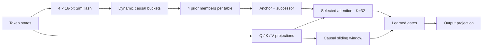

<div align="center">

# Subquadratic Sparse Attention

### Content-routed long-context attention, rebuilt from first principles for Apple silicon.

[](https://github.com/ml-explore/mlx)
[](https://www.python.org/)
[](https://support.apple.com/guide/mac-help/mchl1f6b1e91/mac)
[](LICENSE)

An independent research prototype inspired by the public behavioral claims in the
[SubQ-1.1-Small model card](https://subq.ai/docs/subq-1-1-small-model-card.pdf).
The original SSA mechanism is unpublished; this repository proposes and tests a different architecture.

</div>

---

## What works

The current model combines causal sliding-window attention with content-addressed retrieval through four learned 16-bit SimHash tables. Each query reads a fixed 32-token budget, regardless of context length.

| Result | Measurement |
|---|---:|
| Exact selector recall at 16K | **100 / 100 needles** |
| Selector latency at 16K | **1.45 ms** |
| Selector peak memory at 16K | **27 MB** |
| Selected-attention latency at 16K | **17.5 ms** |
| Selected-attention peak memory at 16K | **57 MB** |
| Numerical error against NumPy | **< 9 × 10⁻⁷** |
| MQAR held-out accuracy at training length | **99.92%** |
| MQAR accuracy at 16× training length | **95.22%** |

The model was trained at 128 tokens and evaluated without further training:

| Context | Relative length | Accuracy |
|---:|---:|---:|
| 128 | 1× | 100.00% |
| 256 | 2× | 99.01% |
| 512 | 4× | 99.08% |
| 1,024 | 8× | 95.38% |
| 2,048 | 16× | 95.22% |
| 4,096 | 32× | 77.93% |

> [!IMPORTANT]
> These are synthetic multi-query associative-recall results from a tiny experimental model. They are not general language-model, RULER, GPQA, or production-serving results.

## Architecture



The selector computes hashes directly instead of scoring every query against every key. Portable prefill sorts hash codes in `O(n log n)`; an append-only hash-table implementation has expected `O(n)` construction and constant expected lookup. Attention reads a fixed `K=32`, so its selected-attention work is linear in sequence length.

[Read the architecture rationale →](docs/architecture.md)

## Quick start

Requirements: an Apple-silicon Mac, Python 3.11+, and MLX.

```bash
git clone https://github.com/Lulzx/subquadratic-sparse-attention.git
cd subquadratic-sparse-attention
python3 -m venv .venv
source .venv/bin/activate
pip install -r requirements-mlx.txt
```

Run the correctness suite:

```bash
python3 mlx_tests.py
python3 mlx_selector.py
```

Train and evaluate the tiny associative-recall model:

```bash
python3 mlx_train.py \
  --steps 300 \
  --seq-len 128 \
  --output runs/mlx-ssa-128.safetensors

python3 mlx_evaluate.py \
  runs/mlx-ssa-128.safetensors \
  --lengths 128,256,512,1024,2048,4096
```

Benchmark the memory-bounded MLX paths:

```bash
python3 mlx_selector.py
python3 mlx_attention_bench.py
```

All benchmark commands have conservative default context limits. See [memory safety](docs/memory-safety.md) before overriding them.

## Documentation

| Document | Contents |
|---|---|
| [Documentation index](docs/index.md) | Reading paths and project map |
| [Architecture](docs/architecture.md) | Hash routing, causal lookup, block reads, gates, and complexity |
| [MLX implementation](docs/mlx-implementation.md) | Kernels, chunking, autograd boundary, and module structure |
| [Experiments and results](docs/experiments.md) | Exact protocols, tables, environment, and interpretation |
| [Model-card claim audit](docs/model-card-audit.md) | What the SubQ report's public arithmetic supports and what cannot be reproduced |
| [Reproduction guide](docs/reproduction.md) | Installation and every safe command |
| [Memory safety](docs/memory-safety.md) | Guardrails added after an unsafe dense allocation |
| [Design history](docs/design-history.md) | Failed fixed-bucket design and the LSH pivot |
| [Limitations and roadmap](docs/limitations.md) | Epistemic boundaries and next experiments |

## Repository layout

```text
ssa/
  mlx_selector.py       # content hashing and causal bucket lookup
  mlx_attention.py      # RoPE, gathered attention, memory-bounded chunking
  mlx_model.py          # gated sparse/window transformer and tiny LM
  model.py              # PyTorch reference implementation
  tasks.py              # deterministic MQAR data generator
mlx_train.py            # MLX training entrypoint
mlx_evaluate.py         # held-out and length-extrapolation evaluation
mlx_selector.py         # selector benchmark
mlx_attention_bench.py  # selected-attention benchmark
replicate.py            # arithmetic audit of public model-card tables
docs/                   # complete technical record
```

## Why this repository exists

The SubQ report makes unusually strong long-context claims while explicitly leaving its sparse-attention mechanism outside the report. This project treats those claims as a specification, not an implementation guide:

1. audit every public numerical claim that can be checked;
2. identify the actual algorithmic constraint—selection must not hide an all-pairs scorer;
3. build a causally valid selector with bounded reads;
4. test exact retrieval, numerical correctness, scaling, memory, and end-to-end learning independently;
5. report failures and boundaries alongside successes.

The result is not SubQ's SSA. It is a small, inspectable alternative that has begun to satisfy the same class of behavioral requirements.

## License

MIT. See [LICENSE](LICENSE).
