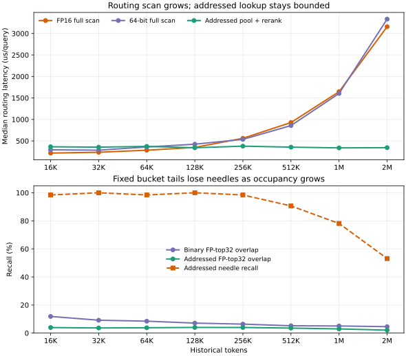
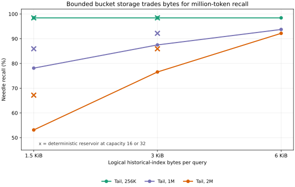

# Experiments and results

## Environment

Measurements in this repository were produced on an Apple-silicon Mac in August 2026 with:

| Dependency | Version |
|---|---:|
| Python | 3.13 |
| MLX | 0.30.0 |
| PyTorch reference | 2.7.1 |
| NumPy | 2.2.6 |

Timings are local single-machine measurements. They are not portable performance guarantees.

## Correctness properties

| Test | Result |
|---|---:|
| Output shapes and finite values | Pass |
| Causality under future-token mutation | Pass; maximum earlier difference `0.0` |
| Identical-content hash colocation | Pass |
| Exact selected position included | Pass |
| 16K exact-needle selector recall | `100 / 100` |
| MLX selected attention vs NumPy | maximum absolute error `8.77e-7` |
| Chunked vs unchunked MLX attention | maximum absolute error `0.0` in test configuration |

## Selector benchmark

Configuration: batch 1, width 64, four 16-bit tables, four prior members per table, anchor plus successor, `K=32`, five timed repetitions.

| Context | Median latency | Peak memory | Exact recall |
|---:|---:|---:|---:|
| 1,024 | 0.58 ms | 1.70 MB | 100% |
| 2,048 | 0.64 ms | 3.39 MB | 100% |
| 4,096 | 0.70 ms | 6.77 MB | 100% |
| 8,192 | 0.99 ms | 13.52 MB | 100% |
| 16,384 | 1.42 ms | 27.02 MB | 100% |

Later regression runs vary slightly—approximately 1.45 ms at 16K—but preserve the same recall and memory scale.

## Selected-attention benchmark

Configuration: batch 1, width 64, four heads, float16 projections, `K=32`, 1,024-query chunks, three timed repetitions.

| Context | Median latency | Peak memory |
|---:|---:|---:|
| 1,024 | 3.08 ms | 43.96 MB |
| 2,048 | 5.30 ms | 44.83 MB |
| 4,096 | 9.70 ms | 46.58 MB |
| 8,192 | 14.94 ms | 50.08 MB |
| 16,384 | 17.54 ms | 57.08 MB |

The nearly flat memory curve is the result of query chunking. This table measures selected attention only, not a complete multi-layer language model.

## End-to-end MQAR training

Training configuration:

| Parameter | Value |
|---|---:|
| Context | 128 tokens |
| Batch | 16 |
| Width | 64 |
| Layers | 2 |
| Heads | 4 |
| Local window | 32 |
| Steps | 300 |
| Learning rate | `1e-3` |
| Selected budget | 32 tokens/query |

Training reached 100% current-batch accuracy by step 250. Evaluation on 1,280 independently seeded associations produced 99.92% accuracy.

## Length extrapolation

The same checkpoint was evaluated without fine-tuning. The number of stored key/value records scales with context length.

| Context | Multiple of training context | Correct / evaluated | Accuracy |
|---:|---:|---:|---:|
| 128 | 1× | 320 / 320 | 100.00% |
| 256 | 2× | 697 / 704 | 99.01% |
| 512 | 4× | 1,395 / 1,408 | 99.08% |
| 1,024 | 8× | 2,686 / 2,816 | 95.38% |
| 2,048 | 16× | 678 / 712 | 95.22% |
| 4,096 | 32× | 1,116 / 1,432 | 77.93% |

The clear result is strong extrapolation through 16× training length and material degradation at 32×. Likely contributors include hash collisions, finite per-bucket history, the tiny model's induction circuit, and training on a single context length.

## Multiprobe curriculum follow-up

A seeded follow-up run jointly changed selector capacity and training lengths:

| Parameter | Value |
|---|---:|
| Seed | 0 |
| Training steps | 1,200 |
| Curriculum | 128, 256, 512, 1,024 tokens; 300 steps each |
| Batch by stage | 16, 8, 4, 2 |
| Width / layers / heads | 64 / 2 / 4 |
| Tables / bits | 8 / 16 |
| Probes / members / block width | 2 / 2 / 2 |
| Selected budget | `K = 64` |

The checkpoint reached 100% held-out accuracy at every curriculum length. A 16-batch, batch-4 extrapolation run produced:

| Context | Correct / evaluated | Accuracy |
|---:|---:|---:|
| 128 | 320 / 320 | 100.00% |
| 256 | 704 / 704 | 100.00% |
| 512 | 1,408 / 1,408 | 100.00% |
| 1,024 | 2,816 / 2,816 | 100.00% |
| 2,048 | 5,690 / 5,696 | 99.89% |
| 4,096 | 10,960 / 11,456 | 95.67% |

This improves the documented 4K baseline from 77.93% to 95.67%, a gain of 17.74 percentage points. The experiment changes tables, probes, members, selected budget, step count, and curriculum together, so it does not identify which change caused the gain.

A smaller batch-1, four-batch frontier check measured 96.09% at 8K (688 / 716) and 75.00% at 16K (537 / 716). MQAR caps stored pairs at 512, so beyond 4K these cases increase retrieval distance and filler rather than the number of associations.

## Controlled 4K ablation

The joint follow-up changed too many variables to identify the source of the gain. A controlled ablation held width, layers, heads, optimizer, 1,200 training steps, curriculum, evaluation seed, and selected budget `K=32` fixed. Each reported selector configuration was trained with seeds 0, 1, and 2 and evaluated on 11,456 answers per seed at 4K.

| Configuration | Seed 0 | Seed 1 | Seed 2 | Aggregate / evaluated | Mean accuracy |
|---|---:|---:|---:|---:|---:|
| 4 tables, 1 probe, 4 members | 95.38% | 96.29% | 95.16% | 32,860 / 34,368 | 95.61% |
| 8 tables, 1 probe, 2 members | 96.99% | 97.38% | 96.72% | 33,347 / 34,368 | **97.03%** |
| 4 tables, 2 probes, 2 members (corrected evaluation) | 94.87% | 93.26% | 94.56% | 32,385 / 34,368 | 94.23% |

Extra tables improve every tested seed at fixed read budget. The original multiprobe
implementation inserted keys under every probe code and sorted the entire sequence
before causal filtering, allowing future entries to displace eligible past bucket
members. After switching to standard query-only probing with keys stored once under
their exact codes, the already-trained multiprobe checkpoints fall to 94.23%. They
were optimized under the old selector and must be retrained before multiprobe can be
compared fairly. The eight-table/one-probe headline is unchanged at 97.03% under the
corrected selector.

Two additional seed-0 controls isolate curriculum from training duration under the original four-table selector:

| Training schedule | Steps | 4K accuracy |
|---|---:|---:|
| 128 tokens only | 300 | 78.99% |
| 128 tokens only | 1,200 | 82.30% |
| 128, 256, 512, 1,024 curriculum | 1,200 | 95.38% |

On this seed and matched evaluation protocol, additional optimizer steps account for 3.31 percentage points, while changing from 128-only training to the length curriculum at 1,200 steps accounts for another 13.08 points. The curriculum is therefore the dominant measured cause of the recovered 4K accuracy.

## Extended-curriculum frontier

Because curriculum was the dominant 4K intervention, a seed-0 exploratory series extended the same eight-table, one-probe, `K=32` model to longer training stages. Every stage received 300 steps. Evaluation used batch 1 and 16 batches at each reported extrapolation length.

| Maximum training length | Training steps | 8K accuracy | 16K accuracy | 32K accuracy |
|---:|---:|---:|---:|---:|
| 1,024 | 1,200 | 95.81% | 74.23% | — |
| 4,096 | 1,800 | 99.97% | 89.70% | — |
| 8,192 | 2,100 | 100.00% | **95.67%** | 91.41% |

The 16K rows each evaluate 2,864 answers. The 32K result also evaluates 2,864 answers after a one-batch memory-safety probe completed successfully; peak evaluation memory was 499 MB. The 8K training stage raised observed peak training memory to 1.64 GB and reduced average throughput for the full run to 15.4 steps/s.

The movement of the failure frontier strongly tracks maximum curriculum length on this seed. It does not establish the same result across training seeds, and MQAR stops increasing its association count after 4K because the task has only 512 distinct keys. Beyond that point, longer sequences add filler and retrieval distance.

### Stagewise 8K fine-tuning

The 4K checkpoint was also continued for 300 steps at 8K using the new `--resume` path. Model weights were restored, while AdamW state intentionally started fresh.

| 8K training strategy | 16K accuracy | 32K accuracy |
|---|---:|---:|
| One optimizer across the full 2,100-step curriculum | 95.67% | 91.41% |
| Resume 4K checkpoint; fresh optimizer for 300 steps at 8K | **97.38%** | **95.32%** |

Both rows use seed 0 and evaluate 2,864 answers per length. The stagewise run indicates that carrying optimizer moments across large length transitions can hurt the final frontier. It also avoids replaying earlier stages when a shorter-context checkpoint already exists. This is one seed and does not yet establish the best reset schedule or learning rate.

## PyTorch reference results

The initial PyTorch/MPS language-model curriculum did not learn general associative retrieval in the tested configurations, although it could overfit a fixed batch to 100%. This was useful evidence that optimization worked but the setup was not producing a general circuit.

The MLX model differs in implementation details, including an untied output projection, so its success should not be attributed solely to the runtime. The runtime did make iteration substantially faster and enabled the current memory-bounded implementation.
## Semantic-router and compressed-global seed-0 probe

This 2026-08-15 experiment is exploratory and single-seed. It tests whether two ideas
from the replication roadmap can be trained without changing the selected-token budget.

Protocol:

- Apple M4 Pro with 24 GB unified memory;
- width 64, two layers, four heads, window 32;
- eight total tables, 16 bits, two members, one probe, `K=32`;
- 300 steps at length 128, batch 16, seed 0;
- 16 held-out batches at length 128;
- eight batch-1 held-out batches at 2K and 4K.

| Variant | 128 | 2K | 4K |
|---|---:|---:|---:|
| Baseline | 99.84% | 97.47% | **80.73%** |
| Four compressed global slots | **100.00%** | 96.21% | 79.68% |
| Hybrid semantic router | 99.61% | 94.80% | 80.03% |
| Hybrid semantic router + four global slots | 99.77% | 94.38% | 77.93% |

The original all-semantic selector replaced every shared hash table with separate Q/K
hashes. It collapsed to 0.16% held-out accuracy at length 128. Semantic loss weights
of 0.1, 0.05, and 0.01 also remained at or below 0.23%. A fixed-budget hybrid that
retains four shared fallback tables restored learning, but neither it nor the global
summary path improved extrapolation in this seed.

This is evidence against the immediate mechanisms, not against semantic routing or
global compression generally. Exact MQAR rewards identical token hashes, the from-scratch
sparse Q/K projections are not a trained dense teacher, and slot means blend mostly
filler at long lengths. The next semantic experiment must use a pretrained dense donor
or explicit query-to-source labels; the next compressed path should learn block
summaries instead of using fixed means.

## SmolLM2 natural-language donor-router distillation

This 2026-08-15 experiment uses the frozen BF16
[SmolLM2-135M base model](https://huggingface.co/HuggingFaceTB/SmolLM2-135M) as a real
dense-attention teacher. It trains only a standalone hash router and does not replace
the donor's attention layer or measure language-model output quality.

Protocol:

- donor layer 15 of 30;
- 256-token sequences from repository prose;
- 32 training segments and four held-out segments from disjoint documentation files;
- first four key positions excluded as attention sinks;
- local 32-token window excluded from the routing target;
- eight tables, eight bits, four members, one probe, maximum hard budget 32;
- straight-through binary codes, 2,000 optimizer steps;
- seeds 0, 1, and 2;
- 876 held-out distant queries per seed.

| Metric | Seed 0 before / after | Seed 1 before / after | Seed 2 before / after | Mean before / after |
|---|---:|---:|---:|---:|
| Hard retained teacher mass | 29.65 / 33.16% | 26.81 / 33.54% | 25.51 / 33.38% | **27.32 / 33.36%** |
| Hard teacher top-1 recall | 40.07 / 57.42% | 36.19 / 54.45% | 35.16 / 55.48% | **37.14 / 55.78%** |
| Mean unique hard candidates | 17.48 / 11.53 | 16.90 / 12.05 | 16.47 / 11.52 | **16.95 / 11.70** |
| Continuous top-32 mass | 41.04 / 68.18% | 47.30 / 67.66% | 39.12 / 68.92% | **42.48 / 68.25%** |
| Continuous top-32 top-1 recall | 41.89 / 88.70% | 54.79 / 83.68% | 36.42 / 84.36% | **44.37 / 85.58%** |

Two failed intermediate designs were necessary to make the measurement honest:

1. Including the first tokens produced 100% top-1 recall with one candidate because
   the router learned an attention sink. Sink exclusion yields 143 distinct teacher
   top-1 positions in the held-out set, with the most common only 4.22% of queries.
2. Looking up the most recent bucket members and discarding local tokens afterward
   allowed local collisions to consume the sparse budget. `min_distance=window` now
   seeks directly before the local cutoff.

The hard router improves all three seeds despite returning fewer unique candidates.
However, it retains only about half the mass available to its own continuous top-32
scores. The next router experiment should focus on quantization/indexing fidelity:
learned multi-probe policies, smaller independently calibrated code groups, or a
two-stage hash-plus-rerank selector. It should not increase the hard budget silently.

This is partial natural-language evidence for learned content routing. It is not yet
evidence for language-model quality, subquadratic end-to-end execution, RULER, or NIAH.

## LFM2.5 paired donor smoke tests

The current-generation donor pair was tested locally on 2026-08-15:

- [LFM2.5-350M](https://huggingface.co/LiquidAI/LFM2.5-350M) is the causal LM donor;
- [LFM2.5-Embedding-350M](https://huggingface.co/LiquidAI/LFM2.5-Embedding-350M) is
  the frozen bidirectional semantic block teacher.

The causal MLX experiment targeted attention layer 14 with eight 256-token training
segments, two held-out segments, eight 8-bit tables, four members, one probe, and 200
optimizer steps. Across seeds 0, 1, and 2 (438 held-out distant queries each), hard
teacher top-1 recall rose from **13.39% to 32.95%**, and retained teacher mass rose from
**11.51% to 22.92%**. Mean candidates increased from 9.54 to 13.23. Continuous top-32
top-1 recall rose from 51.60% to 62.25%, leaving a 29.30-point hard-index gap. Peak MLX
memory was 834.90 MB. This validates current-model router learning, but still does not
replace a donor layer or establish preserved language quality.

### Learned-router failure attribution

The three trained layer-14 checkpoints were re-audited on four held-out 256-token
segments per seed (876 distant queries per seed). Teacher importance is the mean over
heads of attention probability multiplied by value-vector L2 norm, normalized over
eligible distant keys. This follows the pivotal-token contribution criterion in
[HashAttention](https://arxiv.org/abs/2412.14468). The audit measures hard selected
candidates, address occupancy, table dependence, and retrieval distance from the same
evaluation examples.

| Diagnostic | Original objective | Inference-aligned objective |
|---|---:|---:|
| Exact query/key agreement in any table | 69.14% | **80.33%** |
| Hard teacher top-1 recall | 28.27% | **37.40%** |
| Hard retained teacher contribution | 23.41% | **30.97%** |
| Soft top-32 teacher top-1 recall | 65.53% | **74.77%** |
| Mean unique hard candidates | 12.33 | 15.96 |
| Pair-collision inflation over balanced 8-bit hashes | 17.22× | **13.39×** |
| No-address-agreement failure | 30.86% | **19.67%** |
| Agreement followed by bucket-tail eviction | **40.87%** | 42.92% |

The follow-up continues each original seed for 200 steps. It adds weighted top-32
binary classification, as used by HashAttention, but adapts it to SubQ's bounded
lookup: importance-ranked targets are distributed round-robin across eight tables, so
each table owns four positives matching its four-member tail. The classifier consumes
straight-through hard Hamming distance, not soft bit probabilities. Positive weight
10 was selected by a seed-0 sweep over 5, 10, and 20.

The first unpartitioned objective exposed a collapse mode: address agreement reached
99.43%, but collision inflation reached 64.16× and recall only 32.88%. A generic bit
decorrelation loss also reduced collisions while harming agreement and recall. The
capacity-aware objective avoids both errors: compared with the original objective,
retained contribution and top-1 recall each improve 32.3%, while collision inflation
falls 22.2%. Retained contribution improves by 32.0%, 29.5%, and 42.0% in the 1–64,
65–128, and 129–256 distance bands respectively. Long-distance top-1 recall remains
6.11%, so bounded-tail eviction is still the dominant unresolved bottleneck.

### Fixed-budget bucket-history retention

A selector-only follow-up changes which four members each table retains without
changing the eight-table, one-probe, `K=32` budget. The `hybrid` policy keeps the
three newest eligible matching keys and uses the fourth slot for the key halfway
through the causal bucket history. `recent` remains the default, and the accepted
history fraction is 0.5.

The matched audit uses the same three inference-aligned checkpoints and four held-out
256-token segments per seed (876 distant queries per seed):

| Metric | Recent | Hybrid 0.5 | Delta |
|---|---:|---:|---:|
| Retained teacher contribution | 30.97% | **31.91%** | +0.93 points |
| Teacher top-1 recall | 37.40% | **38.62%** | +1.22 points |
| Agreement followed by eviction | 42.92% | **41.70%** | -1.22 points |
| Mean unique candidates | 15.96 | 16.48 | +0.53 |

Retained contribution improves on every seed by 0.84–0.99 points. Top-1 recall also
improves on every seed. By distance, medium-range recall rises from 27.62% to 30.58%
and long-range recall from 6.11% to 8.88%. Near-range recall falls from 59.74% to
58.77%, although near-range retained contribution rises from 40.01% to 40.52%. The
tradeoff is therefore accepted for the aggregate contribution objective, not as a
uniform recall improvement.

An exact-needle selector benchmark under deliberately high 8-bit collision pressure
also keeps exactly 32 slots. Hybrid recall is 37% versus 23% at 4K, 17% versus 0% at
8K, and 7% versus 0% at 16K. Its 16K peak MLX allocation is 57.02 MB versus 53.27 MB.
The nine-repeat latency measurements are noisy and do not support a speed claim.

The improvement does not transfer as a post-hoc policy switch in the converted
two-layer LFM2.5 behavior gate. On the existing token-router checkpoints, which were
trained and recovered with recent-tail selection, hybrid 0.5 produces:

| Policy | Exact | Dense-pass lexical | 13-token variable | All dense-pass cases |
|---|---:|---:|---:|---:|
| Recent | **27/27** | **24/24** | **6/27** | **57/78** |
| Hybrid 0.5 | **27/27** | **24/24** | 3/27 | 54/78 |

All six dense-pass instruction cases remain preserved. Mean sparse-minus-dense answer
loss across seeds also rises from 0.1313 to 0.1414. Hybrid is therefore rejected as
an inference-only production switch.

Retraining the token routers with hybrid selection active changes the result. Starting
from the same joint-KL-recovered sparse branches and using the same 300-step source-
position curriculum gives:

| Seed | Recent variable / all | Hybrid-trained variable / all |
|---:|---:|---:|
| 0 | 2/9 / 19/26 | **8/9 / 25/26** |
| 1 | **4/9 / 21/26** | 0/9 / 17/26 |
| 2 | 0/9 / 17/26 | **9/9 / 26/26** |
| **Total** | 6/27 / 57/78 | **17/27 / 68/78** |

Exact retrieval remains 27/27, dense-pass lexical retrieval remains 24/24, and all
six dense-pass instruction cases remain preserved. The hybrid-trained `K=32` result
also exceeds the completed-block `K=64` result of 13/27 long values and 64/78 overall.
Mean sparse-minus-dense answer loss falls to 0.0193. The gain is not uniform: seed 1
loses all four of its recent-policy long-value successes, so the aggregate improvement
must not be presented as seed-independent.

The matching 65,536-token paired quality audit passes the existing gate:

| Seed | WikiText-2 ratio (95% CI) | PG-19 ratio (95% CI) |
|---:|---:|---:|
| 0 | 0.9989 (0.9740–1.0247) | 0.8970 (0.8693–0.9258) |
| 1 | 1.0187 (0.9931–1.0460) | 0.9000 (0.8719–0.9291) |
| 2 | 1.0042 (0.9793–1.0306) | 0.8949 (0.8680–0.9229) |
| **Geometric mean** | **1.0072** | **0.8973** |

Every WikiText point estimate remains within 2% of dense, although the seed-1
confidence interval does not rule out a larger regression. Router training peaks at
1.25 GB, behavior evaluation at 1.60 GB, and quality evaluation at 1.38 GB of MLX
allocator memory. Only the routers were retrained: the sparse attention branches still
come from recovery under recent-tail selection. Hybrid-aware sparse recovery remains
untested.

[BinaryPC](https://arxiv.org/abs/2608.04405) independently supports data-aware binary
codes and a small error-aware safeguard for hard-to-hash tokens. Its global Hamming
top-k scan is not adopted here because it would reintroduce quadratic query-by-history
work in the current portable implementation. The hybrid history slot is an opt-in
fixed-budget selector intervention; it does not add a global scan or change
completed-block mode.

These are selector and objective ablations for a standalone trained router. They do
not replace the existing perplexity and behavior gates for converted models. Reproduce
them with `mlx_router_audit.py` as documented in [Reproduction](reproduction.md).

The embedding probe used 40 repository-documentation sections for training and 32
sections from disjoint files for evaluation. A query is a heading and its positive
document is that section body. Continuous cosine top-1 recall was 28.12%. The table
below shows the three-seed mean held-out positive recall and fraction of all blocks
admitted by a shared random hyperplane hash:

| Tables | Hamming radius | Positive recall | Candidate fraction |
|---:|---:|---:|---:|
| 1 | 0 | 1.04% | 0.52% |
| 1 | 2 | 16.67% | 19.43% |
| 4 | 1 | 33.33% | 19.14% |
| 4 | 2 | 76.04% | 57.52% |
| 8 | 1 | 57.29% | 36.75% |
| 8 | 2 | 92.71% | 82.23% |

A learned shared projection improved the mean low-budget one-table/radius-two point to
25.00% recall at 16.41% candidates, but was worse than random projection at the
largest settings (67.71% versus 92.71% recall for eight tables/radius two). A first
attempt with independent query/key projections collapsed to 6.25% held-out recall;
it overfit the 40-section corpus and was replaced by a shared projection that preserves
the embedding model's geometry. The useful result is the measured multiprobe tradeoff,
not a claim that this toy corpus validates semantic generalization.

## LFM2.5 layer-14 sparse replacement

This is the first experiment that performs donor surgery rather than measuring a
standalone selector. It replaces only full-attention layer 14 of
[LFM2.5-350M](https://huggingface.co/LiquidAI/LFM2.5-350M). The other five attention
layers, ten convolution layers, all MLPs and norms, embeddings, and LM head remain
unchanged. Q/K/V/O and LFM's GQA normalization and RoPE initialize from the donor.

Each seed uses its corresponding eight-table router checkpoint, a 32-token local
window, four sink tokens, and at most 32 distant candidates. The sparse branch is
aligned for 1,000 steps at 256 tokens on 32 segments from the
[WikiText-2 raw](https://huggingface.co/datasets/Salesforce/wikitext) training split.
Eight validation segments measure layer alignment; 16 disjoint test segments (4,096
tokens) measure causal-LM loss. The replacement gate is zero-cost epistemically: at
zero it reproduces donor loss exactly; at one it skips dense attention entirely.

| Metric | Before alignment | After alignment |
|---|---:|---:|
| Held-out attention NRMSE | 0.3392 | **0.2757** |
| Held-out attention cosine | 0.9513 | **0.9592** |
| Held-out full-layer NRMSE | 0.1870 | **0.1559** |
| WikiText perplexity | 9,572.69 | **7,692.09** |
| Perplexity relative to dense donor | +26.49% | **+1.64%** |

The dense donor perplexity is 7,567.67 under this tokenizer/protocol. Absolute
perplexity is high because this is the instruction-tuned 350M checkpoint evaluated on
raw WikiText; the controlled within-checkpoint ratio is the relevant measurement.
Per-seed final ratios are 1.0118, 1.0277, and 1.0098. The zero-gate loss delta is
exactly 0.0 for every seed. Peak MLX allocator memory is 1.15 GB.

This partially reproduces pretrained-model conversion with small quality loss, but it
is not total replication: only one of six attention layers is replaced, the test set
is small, no RULER/NIAH or general capability suite has run, incremental decoding is
absent, and portable bucket construction still sorts.

## LFM2.5 two-layer composition and joint recovery

Layer 12 was converted with the same protocol as layer 14. Its router is stronger:
hard teacher top-1 recall rises from 19.71% to 49.16%, and retained teacher mass from
14.56% to 29.69%. Independent sparse alignment reduces layer-12 attention NRMSE from
0.2512 to 0.2151 and full-layer NRMSE from 0.1216 to 0.1038. Its mean standalone
perplexity ratio is 0.9890; this small apparent improvement is treated as test noise or
regularization, not a capability claim.

Loading independently aligned layers 12 and 14 together gives these three-seed ratios:

| Seed | Layer 12 only | Layer 14 only | Both before recovery | Both after recovery |
|---:|---:|---:|---:|---:|
| 0 | 0.9922 | 1.0118 | 0.9961 | **0.9883** |
| 1 | 0.9826 | 1.0277 | 1.0237 | **0.9980** |
| 2 | 0.9922 | 1.0098 | 1.0157 | **0.9942** |
| Mean | 0.9890 | 1.0164 | 1.0119 | **0.9935** |

Joint recovery runs 500 steps over 32 WikiText training segments. It keeps the entire
donor frozen and trains only the two sparse attention copies against cached dense final
hidden states. Held-out final-hidden NRMSE improves from 0.2638 to 0.2619, and cosine
from 0.9640 to 0.9644. All zero-gate loss deltas remain exactly zero. Peak MLX memory is
1.39 GB, and each seed takes roughly half a minute after data/model loading.
Reloading every jointly recovered checkpoint into a fresh donor reproduces each final
test loss exactly.

The result shows that two independently converted layers can be repaired together on
the local Mac without a measured loss on this small WikiText slice. It does not show
general quality improvement, long-context task retention, or runtime acceleration.

### Expanded paired quality audit

The 4,096-token result above was too small. A follow-up evaluates 256 paired 256-token
segments per corpus (65,536 tokens), with identical inputs for dense and sparse paths
and 10,000 paired bootstrap resamples. The larger result supersedes the small-slice
parity interpretation:

| Corpus | Seed 0 ratio (95% CI) | Seed 1 ratio (95% CI) | Seed 2 ratio (95% CI) | Geometric mean |
|---|---:|---:|---:|---:|
| WikiText-2 test | 1.1099 (1.0811–1.1400) | 1.1159 (1.0867–1.1477) | 1.1042 (1.0758–1.1344) | **1.1100** |
| PG-19 validation | 1.0028 (0.9694–1.0381) | 0.9870 (0.9542–1.0215) | 0.9938 (0.9620–1.0266) | **0.9945** |

All WikiText intervals show a material regression, while every PG-19 interval spans
parity. This distribution dependence demonstrates why a tiny perplexity slice cannot
gate further conversion. Layer 10 conversion is paused until mixed-corpus recovery
reduces the larger WikiText penalty below 2% without harming PG-19.

### Mixed-corpus teacher-distribution recovery

Two diagnostic branches clarified the recovery objective. Training against dense
final hidden states on 131,072 mixed WikiText/PG-19 tokens slightly improved hidden
NRMSE but worsened large-audit perplexity to 1.2058 on WikiText and 1.0885 on PG-19.
Direct next-token training produced very low raw-text perplexity but moved final hidden
states sharply away from the frozen donor, so it is treated as continued pretraining,
not conversion recovery.

The accepted branch instead caches the dense teacher's top-64 next-token probabilities
and the grouped probability mass of the remaining vocabulary. It trains only the two
sparse branches for 500 steps on 256 WikiText and 256 PG-19 segments. Peak MLX memory
is 1.61 GB. The same paired 65,536-token audit gives:

| Corpus | Seed 0 ratio (95% CI) | Seed 1 ratio (95% CI) | Seed 2 ratio (95% CI) | Geometric mean |
|---|---:|---:|---:|---:|
| WikiText-2 test | 0.9644 (0.9398–0.9898) | 0.9699 (0.9449–0.9967) | 0.9681 (0.9434–0.9942) | **0.9675** |
| PG-19 validation | 0.8787 (0.8512–0.9076) | 0.8638 (0.8365–0.8918) | 0.8711 (0.8446–0.8984) | **0.8712** |

Every interval is below parity, so the predeclared less-than-2% perplexity gate passes
for both corpora and all seeds. This is robust evidence for raw-text likelihood
recovery on these two distributions. It is not evidence of improved general quality:
instruction following, long-range retrieval, and broad downstream behavior remain
untested and are the next gate before expanding the conversion.

### Paired behavior gate and retrieval-router supervision

The next gate compares dense and sparse greedy outputs on the same chat-formatted
prompts. It contains four ordinary instruction cases and 27 retrieval cases: exact
passkeys, lexical-mismatch/two-hop names, and 13-token variable-length values at target
lengths 256, 512, and 1,024 and source positions 10%, 50%, and 90%. Accuracy is counted
only by emitted answers; teacher-forced answer loss and per-layer source-token recall
are diagnostic measurements.

With 16 generated tokens allowed, dense LFM2.5 answers 26 of 27 retrieval cases. The
KL-recovered sparse model preserves only 3 of those 26 (11.54%): 2/9 exact passkeys,
1/8 dense-pass lexical-mismatch cases, and 0/9 variable-length values. Both ordinary
instruction cases that the small dense donor answers are preserved.

`mlx_lfm_retrieval_router.py` provides direct supervision for the distant source token
needed at each answer-generation step. It changes only each replacement's query/key
hash projections, streams one prompt through the model at a time, and never caches the
hidden-state corpus. Across three seeds, 300 steps per layer raise mean sampled hard
source-token recall from 11.81% to 95.14% at layer 12 and from 11.81% to 86.81% at
layer 14. Peak MLX memory is 1.24–1.25 GB.

On unseen values, the resulting checkpoints preserve:

| Seed | Exact | Dense-pass lexical | 13-token variable | All dense-pass cases |
|---:|---:|---:|---:|---:|
| 0 | **9/9** | **8/8** | 2/9 | 19/26 |
| 1 | **9/9** | **8/8** | 4/9 | 21/26 |
| 2 | **9/9** | **8/8** | 0/9 | 17/26 |
| **Total** | **27/27** | **24/24** | **6/27** | **57/78** |

The 65,536-token paired quality audit remains close to or better than dense:

| Corpus | Seed 0 ratio (95% CI) | Seed 1 ratio (95% CI) | Seed 2 ratio (95% CI) | Geometric mean |
|---|---:|---:|---:|---:|
| WikiText-2 test | 1.0004 (0.9751–1.0269) | 1.0141 (0.9877–1.0422) | 1.0128 (0.9861–1.0414) | **1.0091** |
| PG-19 validation | 0.9024 (0.8738–0.9325) | 0.9043 (0.8741–0.9353) | 0.8902 (0.8618–0.9200) | **0.8990** |

Every point estimate remains within the 2% WikiText gate, but the intervals for seeds
1 and 2 extend beyond it; the data do not resolve a small WikiText regression. One-token
successor expansion improves seed-0 variable retrieval only to 3/9 and changes the
attention distribution, so it is not accepted as a fix. A broader six-value seed-0
router curriculum also regresses overall preservation to 69.23%. Stronger variable-
span retrieval is required before the behavior gate passes.

### Rejected token-span fixes

The variable-value failure does not disappear with straightforward increases in token
candidates. These seed-0 diagnostics use the same unseen 13-token value:

| Change | Result | Decision |
|---|---:|---|
| 8 tables, 8 members, 2 probes | 3/9 exact passkeys | Reject; only one extra exact case at a much larger K |
| One successor per retrieved token | 3/9 variable values | Reject; changes the attention distribution and remains weak |
| Four-token deduplicated spans | 0/3 variable values at 256 | Reject before long-length scaling |
| Four-token spans + ordinary top-64 KL recovery | 0/3 at 256 | Reject |
| Four-token spans + streamed targeted KL | 0/3 at 256 | Reject |
| Four-token spans + diverse retrieval SFT | 0/3 at 256 | Reject |
| 16 tables × 2 members, fixed `K=32` | 0/3 variable values at 256 | Reject; exact and lexical cases remain intact |

The full top-64 targeted span run was interrupted when measured MLX peak memory reached
1.65 GB, above the operating envelope chosen after the laptop-freeze incident. A safe
top-8, 100-step version peaks at 1.49 GB but does not improve the held-out result.
These controls point away from further token-level tuning and toward a learned block or
span index whose routed unit preserves a complete value, followed by exact token
attention inside the retrieved block.

### Completed-block index: three-seed result

The first block implementation groups four consecutive hidden states, hashes their
mean, and exposes a block only after its final token is outside the 32-token local
window. The router is supervised against the block containing the required source
token. A streamed retrieval-SFT stage then updates only the sparse Q/K/V/O copies on
32 diverse long values. No hidden-state corpus is cached.

With two blocks per table, the distant budget is fixed at `8 × 2 × 4 = 64` tokens.
The paired generation result is:

| Seed | Exact | Dense-pass lexical | 13-token variable | All dense-pass cases |
|---:|---:|---:|---:|---:|
| 0 | **9/9** | **8/8** | 4/9 | 21/26 |
| 1 | **9/9** | **8/8** | 2/9 | 19/26 |
| 2 | **9/9** | **8/8** | 7/9 | 24/26 |
| **Total** | **27/27** | **24/24** | **13/27** | **64/78** |

The token router at `K=32` reaches 57/78 overall and 6/27 long values. The block path
therefore improves overall preservation by 8.97 percentage points and more than doubles
the difficult category, while keeping every established exact and lexical case.

The 65,536-token paired quality audit gives:

| Corpus | Seed 0 ratio (95% CI) | Seed 1 ratio (95% CI) | Seed 2 ratio (95% CI) | Geometric mean |
|---|---:|---:|---:|---:|
| WikiText-2 test | 0.9326 (0.9104–0.9550) | 0.9825 (0.9598–1.0071) | 0.9846 (0.9606–1.0101) | **0.9663** |
| PG-19 validation | 0.8505 (0.8261–0.8764) | 0.8758 (0.8502–0.9023) | 0.8817 (0.8548–0.9093) | **0.8693** |

Block-router training peaks at 1.24 GB, retrieval SFT at 1.44 GB, the quality audit at
1.46 GB, and the full 1,024-token behavior matrix at 1.64 GB. The block result is
replicated, but 13/27 long-value accuracy remains below the acceptance target.

### Expanded retrieval-generalization gate

The earlier 27-case suite reused one value and one template per task. A deterministic
manifest now crosses four task families with three unseen values, two prompt templates,
three source positions, and target lengths 1K, 4K, 8K, and 16K. The values are disjoint
from router training. The manifest contains 288 cases and has SHA-256
`8a97bd71eb1844657fa8161ba7986f85d34a6ba03213b9bd3e3836bc74bd45da`.

Only the 72 1K cases are memory-approved on the local machine. Dense LFM2.5 passes all
18 exact, 18 multi-token, and 18 NIAH-style cases, but only 9/18 lexical-mismatch cases:
one paraphrase template fails for every value and position. Sparse preservation is
therefore measured only on the 63 cases the dense donor passes. Each variant evaluates
the same cases under seeds 0, 1, and 2, giving 189 dense-pass trials.

| Variant | Budget | Preserved | Accuracy | Wilson 95% CI |
|---|---:|---:|---:|---:|
| Recent token routing | 32 | **132/189** | **69.84%** | 62.96–75.94% |
| Hybrid-history token routing | 32 | 127/189 | 67.20% | 60.22–73.49% |
| Completed-block routing | 64 | 111/189 | 58.73% | 51.61–65.51% |

The aggregate recent and hybrid intervals overlap. Their task profiles differ more
than their totals:

| Variant | Exact | Dense-pass lexical | Multi-token | NIAH-style |
|---|---:|---:|---:|---:|
| Recent K=32 | **54/54** | 26/27 | 11/54 | 41/54 |
| Hybrid K=32 | **54/54** | 22/27 | 7/54 | **44/54** |
| Block K=64 | **54/54** | **27/27** | **22/54** | 8/54 |

The result also varies by checkpoint seed:

| Variant | Seed 0 | Seed 1 | Seed 2 | Seed standard deviation |
|---|---:|---:|---:|---:|
| Recent K=32 | 41/63 | 39/63 | **52/63** | 9.07 points |
| Hybrid K=32 | 41/63 | 38/63 | 48/63 | 6.65 points |
| Block K=64 | 34/63 | 37/63 | 40/63 | 3.89 points |

Recent routing preserves 44/63 cases in each near, middle, and far distance band.
Hybrid preserves 41/63 near, 40/63 middle, and 46/63 far; the midpoint history slot
does not produce a uniform distance gain. Block routing preserves 40/63 near, 35/63
middle, and 36/63 far. Value- and template-level results are included in the generated
JSON and Markdown reports.

A one-case dense 4K probe completes but peaks at 2.82 GB; a hybrid K=32 probe peaks at
2.48 GB. Both exceed the 1.792 GB operating limit. Recent and block 4K runs are not
attempted after those failures, and 8K/16K are skipped for every variant. This is an
explicit resource exclusion, not a retrieval result. At 1K, observed peaks are 1.58 GB
for dense, 1.48 GB for token routing, and 1.66 GB for block routing.

The expanded gate rejects the earlier implication that hybrid training is the best
general policy. Hybrid helps NIAH-style retrieval, block routing helps complete
multi-token values, and recent routing is strongest overall. No variant preserves
enough broad behavior to justify converting layer 10. These are local NIAH- and
NoLiMa-style diagnostics, not results on the public NIAH, NoLiMa, or RULER suites.

### Routing-only scan versus persistent addressing

The benchmark targets the index-scan bottleneck identified by
[KARAT](https://arxiv.org/abs/2608.03555) and distinguishes true address lookup from
[BinaryPC](https://arxiv.org/abs/2608.04405)'s cheaper full binary scan.

This synthetic systems benchmark isolates candidate discovery. It excludes index
construction, KV gather, exact candidate attention, and model execution. Each length
uses 64 normalized 64-dimensional near-neighbor queries and returns `K=32` positions.
The matched methods are an FP16 similarity scan, a packed 64-bit Hamming scan, and a
persistent direct-address index with four 16-bit tables, two lowest-margin probes,
capacity 16 per bucket, a bounded 128-entry pool, and Hamming reranking to `K=32`.

Timings are medians from seven repetitions of each of 64 queries, executed one query
at a time after four warmups. Hardware is a 24 GB Apple M4 Pro MacBook Pro; software
is macOS 26.6.2, Python 3.13.4, MLX 0.32.0, and NumPy 2.2.6. Bytes are logical
historical-index payloads read per query, not hardware performance-counter values.

| Keys | FP16 scan | Binary64 scan | Addressed | FP bytes | Binary bytes | Addressed bytes | FP-top32 recall | Needle recall |
|---:|---:|---:|---:|---:|---:|---:|---:|---:|
| 16K | 216.6 us | 293.7 us | 363.8 us | 2 MiB | 128 KiB | 1.5 KiB | 3.96% | 98.44% |
| 32K | 236.1 us | 283.8 us | 354.9 us | 4 MiB | 256 KiB | 1.5 KiB | 3.66% | 100.00% |
| 64K | 283.8 us | 359.1 us | 372.5 us | 8 MiB | 512 KiB | 1.5 KiB | 3.81% | 98.44% |
| 128K | 348.8 us | 424.0 us | 340.7 us | 16 MiB | 1 MiB | 1.5 KiB | 4.05% | 100.00% |
| 256K | 560.9 us | 535.9 us | 378.2 us | 32 MiB | 2 MiB | 1.5 KiB | 4.00% | 98.44% |
| 512K | 928.5 us | 857.0 us | 355.1 us | 64 MiB | 4 MiB | 1.5 KiB | 3.56% | 90.62% |
| 1M | 1,645.8 us | 1,604.6 us | 337.4 us | 128 MiB | 8 MiB | 1.5 KiB | 2.98% | 78.12% |
| 2M | 3,157.9 us | 3,334.2 us | 342.9 us | 256 MiB | 16 MiB | 1.5 KiB | 2.10% | 53.12% |

From 16K to 2M, FP16 and binary latency grow 14.58x and 11.35x; addressed lookup
changes by 0.94x. At 2M the addressed prototype is 9.21x faster than FP16 routing
and 9.72x faster than binary routing. Index construction, reported separately, grows
from 2.39 ms to 116.61 ms and is not yet an append-only decode update. Chunked recall
evaluation keeps peak MLX memory to 432 MB.

The latency and byte curves support bounded candidate discovery. Recall does not yet
support replacing a general attention selector: capacity-16 bucket eviction drops
needle recall from 98.44% at 256K to 78.12% at 1M and 53.12% at 2M, even though
query/target addresses agree in 96.88% of 2M cases.
It recovers only 2.1–4.1% of the FP top 32. These results must not be presented as an
end-to-end model speedup.

### Bucket-retention tradeoff

The matched ablation holds keys, projections, per-length queries, four tables, 16
address bits, two probes, and `K=32` fixed. Separate key, projection, and per-length
query RNG streams make a row invariant to which other lengths appear in the CLI
sweep. This correction supersedes earlier retention numbers produced before the RNG
streams were separated.

| 2M variant | Routing | Bytes/query | Needle recall | FP-top32 recall | Recall given address | Evicted postings |
|---|---:|---:|---:|---:|---:|---:|
| Capacity 16, tail | 306.0 us | 1.5 KiB | 53.12% | 2.10% | 54.84% | 59.45% |
| Capacity 16, reservoir | 346.4 us | 1.5 KiB | 67.19% | 2.29% | 69.35% | 59.45% |
| Capacity 32, tail | 311.2 us | 3 KiB | 76.56% | 3.12% | 79.03% | 36.25% |
| Capacity 32, reservoir | 299.9 us | 3 KiB | **85.94%** | 3.12% | 88.71% | 36.25% |
| Capacity 64, tail | 309.9 us | 6 KiB | **92.19%** | 3.56% | 95.16% | 14.95% |

At 2M, mean nonempty-bucket occupancy is 32.24, p99 is 164, and the maximum is
771. Capacity 64 nearly closes retention loss conditional on a correct address, but
does not reach 95% overall recall and doubles the proposed 3 KiB traffic ceiling.
Reservoir retention improves capacity 32 by 9.38 percentage points without more
traffic, yet remains 9.06 points short of the target. Fingerprint subslots are a
negative result: at 2M they reach only 50.00% at capacity 16 and 67.19% at capacity
32 because collisions leave effective capacity unused.

The next systems gate is therefore a hierarchical or adaptive local posting index:
use secondary addressing or conditional probes only for crowded buckets, then test
the explicit target of at least 95% needle recall, at most 3 KiB/query, and at most
350 us/query. After that, run the same benchmark with model-derived addresses and
targets, report recall/traffic together, and integrate an append-only causal index.
